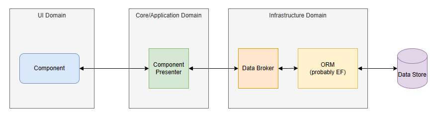

# The Blazor Component Service Scope Conundrum

Apply good design practices to components, and you separate out data management from the display function.  A component such as `FetchData` in the demo project "Fetches(Manages) data AND displays it in a table".  There's an **AND** in there: a very good indicator that `FetchData` has multiple concerns/responsibilities.

Apply the *Single Responsibilty Principle* and you have two classes:

1. `WeatherForcastListForm` - a component that displays a list of WeatherForecasts
2. `WeatherForecastListPresenter` - an object that interfaces with the data pipeline to manage the list of WeatherForecasts.



Take those same design principles further, and you inject an instance of `WeatherForecastListPresenter` into `WeatherForcastListForm` from DI with the same lifecycle scope as the form.

In the DotNetCore framework that presents a dilemna.

1. `Scoped` is too wide: it's scoped for the duration of the SPA session.  It works if used in one place and you want to persist state for the duration of the SPA session.
2. `Transient` is too narrow.
   
   2.1. Sub-components in the Form can't use DI to access the same instance of `WeatherForecastListPresenter`.
   
   2.2. Any class implementing `IDisposable` or `IAsyncDisposable` should never be scoped as *Transient*.  The DI service container maintains a reference to the instance to *Dispose* it when the container itself is *Disposed*.  You create a "memory leak" in your application as copies of `WeatherForecastListPresenter` build up every time you visit the form.  They are only disposed when you close down or refresh you session with the application.


There's no a clean fit.

Step forward `OwningComponentBase`.  It creates it's own scoped service container which it disposes when the component is disposed.  It has the same scope as the component.

Unfortunately there's a fatal flaw: any scoped service your service depends on is also created in the same container.  It is after all just a *Scoped* container.

Consider `AuthenticationService`.  The instance in the SPA scoped container is the one your service needs, but it gets a new vanailla one with no user information.  Same with any Notification services, the NavigationManager and many others.

It's Ok for services with no dependancies, but....  we don't code many of those!

## Solving the Conundrum

The fact is, the DotNetCore service container configuration is designed around the old MVC server side model.  There's no scope, or container, that matches the scope of a component.  Until Microsoft provides one, we need a workaround.

My solution is described below.  It's uses a simple time service and component that display/update a time value to demonstrate the solution.  The timer code is in the appendix.

## The Repo

The repo and latest version of this article can be found here [Blazr.ComponentServiceProvider](https://github.com/ShaunCurtis/Blazr.ComponentServiceProvider).


### Service Utilities

We need code to create and manage our *service*.

It must create an instance of `TService` which:

1. May or may not have DI dependancies.
2. May or may not implement `IDisposable` or `IAsyncDisposable`.
3. May be an interface or base class service definition in the ServiceContainer.

`ActivatorUtilities` is a little known utility class that creates and populates object instances with dependancies in the DI container context.

`GetComponentService` is an extension method on `IServiceContainer` that provides the necessary functionality.  It's deceptively simple:

```csharp
public static class ServiceUtilities
{
    public static TService? GetComponentService<TService>(this IServiceProvider serviceProvider) where TService : class
    {
        var serviceType = serviceProvider.GetService<TService>()?.GetType();

        if (serviceType is null)
            return ActivatorUtilities.CreateInstance<TService>(serviceProvider);

        return ActivatorUtilities.CreateInstance(serviceProvider, serviceType) as TService;
    }
}
```

First step is to try and get an instance of `TService` from the DI Service.  The returned value will either be the concrete registered object for `TService` or `null`.   We assign the concrete type to `serviceType`.

If `serviceType` is null, there's no definition for `TService` in the service container; it must be activated directly.  We call `ActivatorUtilities` and return the provided object instance.  

If `serviceType` is a type, it's activated as the supplied concrete type.

In either case, the method may return a null if `CreateInstance` can't create an instance.

There's also a Try wrapper method to encapsulate the method.

```csharp
    public static bool TryGetComponentService<TService>(this IServiceProvider serviceProvider,[NotNullWhen(true)] out TService? service) where TService : class
    {
        service = serviceProvider.GetComponentService<TService>();
        return service != null;
    }
```

### CascadingComponentService

`CascadingComponentService` is a a component wrapper to encapsulate service creation and disposal.

1. The main code is implemented in `SetParametersAsync`: everything happens before any render event occurs. 
2. The normal component lifecycle processes are short circuited/bypassed.  We don't need them.
3. The cascade component is set as `IsFixed`, to stop any render cascades after the initial render.  The render ignores the parameter when working out if any parameters on a component have changed.
4. `IAsyncDisposable` is implemented to ensure `TService` is disposed correctly.


```csharp
@namespace Blazr.UI
@typeparam TService where TService: class
@implements IAsyncDisposable
@implements IHandleAfterRender
@implements IHandleEvent

<CascadingValue Value="this.ComponentService" IsFixed>
    @this.ChildContent
</CascadingValue>

@code {
    [Parameter] public RenderFragment? ChildContent { get; set; }

    [Inject] private IServiceProvider serviceProvider { get; set; } = default!;

    public TService? ComponentService { get; set; } = default!;

    private bool _firstRender = true;
    private IDisposable? _disposable;
    private IAsyncDisposable? _asyncDisposable;

    public override Task SetParametersAsync(ParameterView parameters)
    {
        parameters.SetParameterProperties(this);

        if (_firstRender)
        {
            this.ComponentService = serviceProvider.GetComponentService<TService>();

            ArgumentNullException.ThrowIfNull(this.ComponentService);

            _disposable = this.ComponentService as IDisposable;
            _firstRender = false;
        }
        // Saving CPU Cycles - No Initialized/OnParametersSet run
        this.StateHasChanged();
        return Task.CompletedTask;
    }

    public async ValueTask DisposeAsync()
    {
        _disposable?.Dispose();

        if (this.ComponentService is IAsyncDisposable asyncDisposable)
            await asyncDisposable.DisposeAsync();
    }

    // Saving CPU Cycles - No AfterRender Handling
    Task IHandleAfterRender.OnAfterRenderAsync()
        => Task.CompletedTask;

    // Saving CPU Cycles - No automatic rendering
    Task IHandleEvent.HandleEventAsync(EventCallbackWorkItem callback, object? arg)
        => callback.InvokeAsync(arg);
}
```

### Demo Page

The display page demonstrates using `CascadingComponentService` and how to capture the service. 

```csharp
@page "/"
@implements IDisposable
@implements IHandleAfterRender
@implements IHandleEvent

<PageTitle>Index</PageTitle>

<CascadingComponentService TService="ITimeService" @ref=_service >
    <TimeStamp />
</CascadingComponentService>

<div class="alert alert-info">
    @(_service?.ComponentService?.Message ?? "No message set.")
</div>

@code {
    private CascadingComponentService<ITimeService>? _service;

    protected async override Task OnInitializedAsync()
    {
        await Task.Yield();
        // Yields to let the UI do a first render and ensure _service is assigned
        if (_service is not null && _service.ComponentService is not null)
            _service.ComponentService.TimeChanged += this.OnTimeChanged;
    }

    private void OnTimeChanged(object? sender, EventArgs e)
        => StateHasChanged();

    public void Dispose()
    {
        if (_service is not null && _service.ComponentService is not null)
            _service.ComponentService.TimeChanged -= this.OnTimeChanged;
    }

    // Saving CPU Cycles - No AfterRender Handling
    Task IHandleAfterRender.OnAfterRenderAsync()
        => Task.CompletedTask;
}
```


### Do it Yourself

You don't need to use the wrapper.  You can `unwrap` the cascade and do it yourself within your root component.

## Wrapping Up

That's it, not rocket science nor very original.

## Appendix 

### The Demo Timer Service

The simple Timer service interface.

```csharp
public interface ITimeService
{
    public string Message { get;}
    public event EventHandler? TimeChanged;
    public void UpdateTime();
}
```

The concrete service.  Debug code is included to monitor instances and disposal.

```csharp
public class TimeService : ITimeService, IDisposable, IAsyncDisposable
{
    public readonly Guid InstanceId = Guid.NewGuid();
    private bool asyncdisposedValue;
    private bool disposedValue;

    public string Message { get; private set; } = DateTime.Now.ToLongTimeString();
    public event EventHandler? TimeChanged;

    public TimeService()
        => Debug.WriteLine($"TimeService - instance {InstanceId} created");

    public void UpdateTime()
    {
        Message = DateTime.Now.ToLongTimeString();
        TimeChanged?.Invoke(this, EventArgs.Empty);
    }

    public ValueTask DisposeAsync()
    {
        if (!asyncdisposedValue)
            Debug.WriteLine($"TimeService - instance {InstanceId} async disposed");

        asyncdisposedValue = true;
        return ValueTask.CompletedTask;
    }

    protected virtual void Dispose(bool disposing)
    {
        if (!disposedValue)
        {
            if (disposing)
                Debug.WriteLine($"TimeService - instance {InstanceId} disposed");

            disposedValue = true;
        }
    }

    public void Dispose()
    {
        Dispose(disposing: true);
        GC.SuppressFinalize(this);
    }
}
```
### TimeStamp

`TimeStamp` is a simple component thats displays and updates the `TimeService`.  `ITimeService` is cascaded.  Debug code shows when `SetParametersAsync` async is called.

```csharp
@namespace Blazr.UI
@implements IHandleAfterRender
@implements IHandleEvent

<div class="bg-light p-2 m-2">

    <h3>TimeStamp Component</h3>

    <div class="m-2">
        <button class="btn btn-primary" @onclick=Clicked>Update Timestamp</button>
    </div>

    <div>
        @(this.TimeService?.Message ?? "No message set.")
    </div>

    <div class="mt-2 bg-dark text-white">
        Parameters Set at at @this.ParametersChangedTimeStamp
    </div>

</div>

@code {
    [CascadingParameter] private ITimeService? TimeService { get; set; } = default!;

    private string ParametersChangedTimeStamp = "Not Set";

    protected override void OnInitialized()
    {
        if (this.TimeService is null)
            throw new NullReferenceException($"The {this.GetType().FullName} required a cascaded ITimeService");
    }

    protected override void OnParametersSet()
    {
        Debug.WriteLine("TimeStamp - Parameter Change");
        this.ParametersChangedTimeStamp = DateTime.Now.ToLongTimeString();
        base.OnParametersSet();
    }

    private void Clicked()
      => TimeService?.UpdateTime();

    // Saving CPU Cycles - No AfterRender Handling
    Task IHandleAfterRender.OnAfterRenderAsync()
        => Task.CompletedTask;

    // Saving CPU Cycles - shortcut the UI event handling code. One render per UI event
    async Task HandleEventAsync(EventCallbackWorkItem callback, object? arg)
    {
        await callback.InvokeAsync(arg);
        StateHasChanged();
    }
}
```
