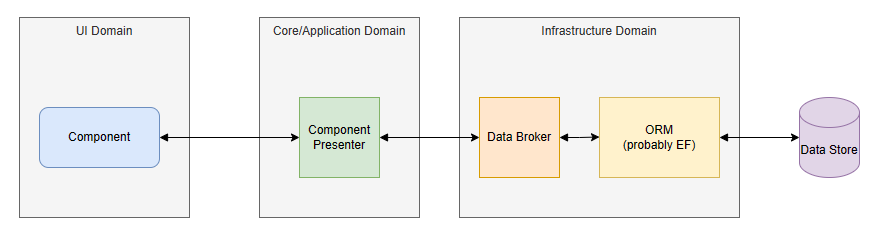

# The Blazor Component Scope Conundrum

Apply good design practices to components, and you separate out the data management function from the display function.  A component such as `FetchData` in the demo project "Fetches(Manages) the data AND displays it in a table".  There's an **AND** in there, a good indicator that `FetchData` may have multiple concerns/responsibilities.

Apply the *Single Responsibilty Principle* and you have two classes:

1. `WeatherForcastListForm` - a component that displays a list of WeatherForecasts: most of the current `FetchData` component.
   
2. `WeatherForecastListPresenter` - an object that interfaces with the data pipeline to manage the WeatherForecast collection.



Taking those same design principles further, you inject an instance of `WeatherForecastListPresenter` into `WeatherForcastListForm` from the DI container with the same lifecycle scope as the form.

In the DotNetCore Blazor framework that dictates `WeatherForecastListPresenter` as *Transient*.  

Unfortunately that's not a clean fit.

1. Sub-components in the Form can't use DI to access the same instance of `WeatherForecastListPresenter`.  It has to be cascaded to them.
   
2. Any class implementing `IDisposable` or `IAsyncDisposable` should never be scoped as *Transient*.  The DI service container maintains a reference to the instance to *Dispose* it when the container itself is *Disposed*.  You create a "memory leak" in your application as copies of `WeatherForecastListPresenter` build up every time you visit the form.  They are only disposed when you close down or refresh you session with the application.

`OwningComponentBase` was designed to fill this gap.  It creates it's own scoped service container which it disposes when the component is disposed.  You can create *Scoped* services that have the same scope as the component.

Unfortunately it's flawed by the current Service Container design.  

Any *Scoped* services that your service depends on are created in the `OwningComponentBase` container: it is a *Scoped* container.  Take `AuthenticationService`.  The instance in the SPA scoped container is the one your service needs, but instead it gets a new one with no user information.  The same applies to Notification services, the NavigationManager and many others.  It's useless, except in very specific circumstances.  

## Solving the Conundrum

The fact is, we have a DotNetCore service container configuration designed around the old MVC server side model.  We have no scope, or a contaner to go with it, that matches the scope of a component.   There's no way to differentiate between an SPA scoped and a Component scoped service.  Until Microsoft fixes the problem, we need a workaround, or we end up forever coding around the problem.

The `ComponentServiceProvider` I demonstrate below fills that gap.

## Repo

The repo and latest version of this article is here [Blazr.ComponentServiceManager](https://github.com/ShaunCurtis/Blazr.ComponentServiceManager).

## ComponentServiceProvider in Action

Here's a simple implementation to demonstate it in action.  The detailed design is in the next section.

A simple Timer Service defined by an interface.

```csharp
public interface ITimeService
{
    public string Message { get;}
    public event EventHandler? TimeChanged;
    public void UpdateTime();
}
```

The concrete service with debug code to see instances created and disposed correctly.

```csharp
public class TimeService : ITimeService, IDisposable, IAsyncDisposable
{
    public readonly Guid InstanceId = Guid.NewGuid();
    private bool asyncdisposedValue;
    private bool disposedValue;

    public string Message { get; private set; } = DateTime.Now.ToLongTimeString();
    public event EventHandler? TimeChanged;

    public TimeService()
        => Debug.WriteLine($"TimeService - instance {InstanceId} created");

    public void UpdateTime()
    {
        Message = DateTime.Now.ToLongTimeString();
        TimeChanged?.Invoke(this, EventArgs.Empty);
    }

    public ValueTask DisposeAsync()
    {
        if (!asyncdisposedValue)
            Debug.WriteLine($"TimeService - instance {InstanceId} async disposed");

        asyncdisposedValue = true;
        return ValueTask.CompletedTask;
    }

    protected virtual void Dispose(bool disposing)
    {
        if (!disposedValue)
        {
            if (disposing)
                Debug.WriteLine($"TimeService - instance {InstanceId} disposed");

            disposedValue = true;
        }
    }

    public void Dispose()
    {
        Dispose(disposing: true);
        GC.SuppressFinalize(this);
    }
}
```

A set of components to display and update the `TimeService`. This is `AdvancedTimeStamp.razor`.  Note:

1. The capture of a cascaded `Guid` named `ComponentServiceId`.
2. The injection of `IComponentServiceProvider`.
3. The private `ITimerService` global variable.
4. The call to `serviceProvider.GetService<ITimeService>(ComponentServiceId)` to get the `ITimerService` instance.

```csharp
@namespace Blazr.UI
@implements IDisposable

<div class="bg-light p-2 m-2">

    <h3>Advanced TimeStamp Component</h3>

    <div class="m-2">
        <button class="btn btn-primary" @onclick=Clicked>Update Timestamp</button>
    </div>

    <div>
        @(timeService?.Message ?? "No message set.")
    </div>

    <div class="mt-2 bg-dark text-white">
        Parameters Set at at @this.ParametersChangedTimeStamp
    </div>

</div>

@code {
    [CascadingParameter(Name = "ComponentServiceId")] private Guid ComponentServiceId { get; set; }

    [Inject] private IComponentServiceProvider serviceProvider { get; set; } = default!;

    private ITimeService? timeService;
    private string ParametersChangedTimeStamp = "Not Set";

    protected override void OnInitialized()
    {
        timeService = serviceProvider.GetService<ITimeService>(ComponentServiceId);

        if (this.timeService is not null)
            timeService.TimeChanged += this.OnUpdate;
    }

    protected override void OnParametersSet()
    {
        Debug.WriteLine("AdvancedTimeStamp - Parameter Change");
        this.ParametersChangedTimeStamp = DateTime.Now.ToLongTimeString();
        base.OnParametersSet();
    }

    private void OnUpdate(object? sender, EventArgs e)
        => InvokeAsync(this.StateHasChanged);

    private void Clicked()
      => timeService?.UpdateTime();

    public void Dispose()
    {
        if (this.timeService is not null)
            timeService.TimeChanged -= this.OnUpdate;
    }
}
```

And our demo page.  Note it creates a Guid to uniquely identify this instance of the component, and passes it to the `ComponentServiceProviderCascade` component. 

```csharp
@page "/"
<PageTitle>Index</PageTitle>
<ComponentServiceProviderCascade ServiceType="typeof(ITimeService)" ComponentServiceId="this.ComponentServiceId">

    <h1>Hello, world!</h1>

    Welcome to your new app.

    <TimeStamp />

    <AdvancedTimeStamp />

</ComponentServiceProviderCascade>

@code {
    private Guid ComponentServiceId = Guid.NewGuid();
}
```

This version adds the `CostlyTimeStamp` and get's the `ITimeService` instance to cascade it.  Note the *Parameters Set* time stamp updates that demonstrate the *Render Cascade* issue with cascading objects.

```csharp
@page "/"
<PageTitle>Index</PageTitle>
<ComponentServiceProviderCascade ServiceType="typeof(ITimeService)" ComponentServiceId="this.ComponentServiceId">

    <h1>Hello, world!</h1>

    Welcome to your new app.

    <TimeStamp />

    <AdvancedTimeStamp />

</ComponentServiceProviderCascade>

<CascadingValue Value="this.timeService">
    <CostlyTimeStamp />
</CascadingValue>

@code {

    [Inject] private IComponentServiceProvider serviceProvider { get; set; } = default!;

    private ITimeService? timeService;
    private Guid ComponentServiceId = Guid.NewGuid();

    protected override void OnInitialized()
        => timeService = serviceProvider.GetOrCreateService<ITimeService>(ComponentServiceId);
}
```
## The Detail

### ComponentService

A record to represent the component service.

```csharp
public record ComponentService(Guid ComponentId, Type ServiceType, object ServiceInstance);
```

### ComponentServiceProvider

`ComponentServiceProvider` uses a static class called `ActivatorUtilities`.  This has various methods that take a `Type` and resolve and populates the type's dependancies from the supplied `ServiceProvider`.  It does need a concrete `Type` definition.  If the supplied `Type` is an  interface, `ComponentServiceProvider` tries to resolve the registered concrete type in the provided `ServiceProvider`.

First, the interface:

```csharp
public interface IComponentServiceProvider
{
    public object? GetOrCreateService(Guid componentId, Type? serviceType);
    public TService? GetOrCreateService<TService>(Guid componentId);
    public object? GetService(Guid componentId, Type serviceType);
    public TService? GetService<TService>(Guid componentId);
    public bool TryGetService<TService>(Guid componentId, [NotNullWhen(true)] out TService? value);
    public ValueTask<bool> RemoveServiceAsync<TService>(Guid componentId);
    public ValueTask<bool> RemoveServiceAsync(Guid componentId, Type serviceType);
}
```

The class:

1. Implements `IComponentServiceProvider` and both `IDisposable` and `IAsyncDisposable` because it needs to dispose objects that may implement either.
2. Defines the `IServiceProvider` in it's constructor.
3. Creates an internal list of registered service objects.
4. Creates `InstanceId` as a unique identifier used in debugging.
5. `asyncdisposedValue` and `disposedValue` provide disposal control.

```csharp
public class ComponentServiceManager : IDisposable, IAsyncDisposable
{
    private IServiceProvider _serviceProvider;
    private List<ComponentService> _componentServices = new List<ComponentService>();
    private bool asyncdisposedValue;
    private bool disposedValue;
    public readonly Guid InstanceId = Guid.NewGuid();

    public ComponentServiceManager(IServiceProvider serviceProvider)
    {
        Debug.WriteLine($"ComponentServiceManager - instance {InstanceId} created");
        _serviceProvider = serviceProvider;
    }
```

`tryFindComponentService` is internal and defines the search Linq query for the service list.

```csharp
private bool tryFindComponentService(Guid componentId, Type serviceType, [NotNullWhenAttribute(true)] out ComponentService? result)
{
    result = _componentServices.SingleOrDefault(item => item.ComponentId == componentId && item.ServiceType == serviceType);
    if (result is default(ComponentService))
        return false;

    return true;
}
```

`GetOrCreateService` are two public methods that attempt to create a new instance of a service if one doesn't currently exist.

```csharp
public object? GetOrCreateService(Guid componentId, Type? serviceType)
    => getOrCreateService(componentId, serviceType);

public TService? GetOrCreateService<TService>(Guid componentId)
{
    var service = this.getOrCreateService(componentId, typeof(TService));
    return service is null
        ? default
        : (TService)service;
}
```

`getOrCreateService` is the internal workload method. It:  

1. Checks if a service is already registered against the Guid and if so returns it.
2. Creates a new instance by calling `tryCreateService`.
3. `tryCreateService` uses the `ActivatorUtilities` static class to attempt to create instance.  It fails if `serviceType` is not a  *concrete* type.
4. On failure it calls `tryCreateInterfaceService` which attempts to get the interface definition from the service container and then create an instance with `ActivatorUtilities`.

The result is a `null`, or an instance of the type with the correctly injected instances from the SPA scoped service container.  A *Transient* service with no retained reference in the `ServiceProvider`.  Disposal is the requester's responsibility. 

```csharp
private object? getOrCreateService(Guid componentId, Type? serviceType)
{
    if (serviceType is null || componentId == Guid.Empty)
        return null;

    // Try getting the service from the collection
    if (this.tryFindComponentService(componentId, serviceType, out ComponentService? service))
        return service.ServiceInstance;

    // Try creating the service
    if (!this.tryCreateService(serviceType, out object? newService))
        this.tryCreateInterfaceService(serviceType, out newService);

    if (newService is null)
        return null;

    _componentServices.Add(new ComponentService(componentId, serviceType, newService));

    return newService;
}

private bool tryCreateService(Type serviceType, [NotNullWhen(true)] out object? service)
{
    service = null;
    try
    {
        service = ActivatorUtilities.CreateInstance(_serviceProvider, serviceType);
        return true;
    }
    catch
    {
        return false;
    }
}

private bool tryCreateInterfaceService(Type serviceType, [NotNullWhen(true)] out object? service)
{
    service = null;
    var concreteService = _serviceProvider.GetService(serviceType);
    if (concreteService is null)
        return false;

    var concreteInterfaceType = concreteService.GetType();

    try
    {
        service = ActivatorUtilities.CreateInstance(_serviceProvider, concreteInterfaceType);
        return true;
    }
    catch
    {
        return false;
    }
}
```

There are three public `GetService` public methods and a single private workload `getService` which resolves the requested `Type` from the internal collection.

```csharp
public object? GetService(Guid componentId, Type? serviceType)
{
    this.tryGetService(componentId, serviceType, out object? value);
    return value;
}

public TService? GetService<TService>(Guid componentId)
{
    this.tryGetService(componentId, typeof(TService), out object? value);
    return (TService?)value;
}

public bool TryGetService<TService>(Guid componentId, [NotNullWhen(true)] out TService? value)
{
    var result =this.tryGetService(componentId, typeof(TService), out object? service);
    value = (TService?)service;
    return result;
}

private bool tryGetService(Guid componentId, Type? serviceType, [NotNullWhen(true)] out object? service)
{
    service= null;

    if (serviceType is null || componentId == Guid.Empty)
        return false;

    if (!this.tryFindComponentService(componentId, serviceType, out ComponentService? componentService))
        return false;

    service = componentService.ServiceInstance;
    return true;
}
```

`RemoveService` disposes the resolved `Type` and removes it from the internal collection.  It's a task base async method because the instance may implement `IAsyncDisposable`.

```csharp
public ValueTask<bool> RemoveServiceAsync<TService>(Guid componentId)
    => removeServiceAsync(componentId, typeof(TService));

public ValueTask<bool> RemoveServiceAsync(Guid componentId, Type serviceType)
    => removeServiceAsync(componentId, serviceType);

private async ValueTask<bool> removeServiceAsync(Guid componentId, Type serviceType)
{
    if (!this.tryFindComponentService(componentId, serviceType, out ComponentService? componentService))
        return false;

    if (componentService.ServiceInstance is IDisposable disposable)
        disposable.Dispose();

    if (componentService.ServiceInstance is IAsyncDisposable asyncDisposable)
        await asyncDisposable.DisposeAsync();

    _componentServices.Remove(componentService);

    return true;
}
```

`Dispose` and `DisposeAsync` are called when the service is disposed.  They dispose properly any remaining objects in the service collection.

```csharp
protected virtual void Dispose(bool disposing)
{
    if (disposedValue || !disposing)
    {
        disposedValue = true;
        return;
    }

    Debug.WriteLine($"ComponentServiceManager - instance {InstanceId} disposed");

    foreach (var componentService in _componentServices)
    {
        if (componentService.ServiceInstance is IDisposable disposable)
            disposable.Dispose();
    }

    disposedValue = true;
}

public void Dispose()
{
    Dispose(disposing: true);
    GC.SuppressFinalize(this);
}

public async ValueTask DisposeAsync()
{
    if (asyncdisposedValue)
        return;

    Debug.WriteLine($"ComponentServiceManager - instance {InstanceId} async disposed");

    foreach (var componentService in _componentServices)
    {
        if (componentService.ServiceInstance is IAsyncDisposable asyncDisposable)
            await asyncDisposable.DisposeAsync();
    }

    asyncdisposedValue = true;
}
```

### ComponentServiceProviderCascade

`ComponentServiceProviderCascade` is a wrapper that implements the functionality to properly manage the service object creation and it's disposal.

`ServiceType` defines the shared service object.  `ComponentServiceId` is the unique Id for the component.  If one isn't provided, it generates one.  The component implements `IAsyncDisposable` to dispose the service instance when the component is disposed (by the Renderer).  The async version is implemented because `RemoveServiceAsync` is a `ValueTask` based method.

```csharp
@implements IAsyncDisposable

<CascadingValue Name="ComponentServiceId" Value="this.ComponentServiceId">
    @this.ChildContent
</CascadingValue>

@code {
    [Parameter] public RenderFragment? ChildContent { get; set; }
    [Parameter] public Guid ComponentServiceId { get; set; } = Guid.NewGuid();
    [Parameter, EditorRequired] public Type? ServiceType { get; set; }
    [Inject] private IComponentServiceProvider serviceProvider { get; set; } = default!;

    protected override void OnInitialized()
        => serviceProvider.GetOrCreateService(ComponentServiceId, ServiceType);

    public async ValueTask DisposeAsync()
    {
        if (this.ServiceType is not null)
            await serviceProvider.RemoveServiceAsync(ComponentServiceId, this.ServiceType);
    }
}
```

You can `unwrap` the cascade into your root component.  It's primary intent is to ensure the created instance is disposed.

## Wrapping Up

That's it, not rocket science: not perfect either.  Comments on improvements/things I've got wrong gratefully received.

And my (very humble) thought's on what we really need? 

Add a new scope - say `Component`.  Add a new container implementation called `ComponentScoped`.  It can be created from a `ScopedContainer` i.e. it's parent is a `ScopedContainer`.

Add a new property based attribute `ComponentInjectAttribute` for components.

Add an `IServiceComponent` interface that defines the necessary functionality for the Renderer.

The Renderer understands the `IServiceComponent` context and `ComponentInject` and injects services from the correct container if a parent `IServiceComponent` container exists.
